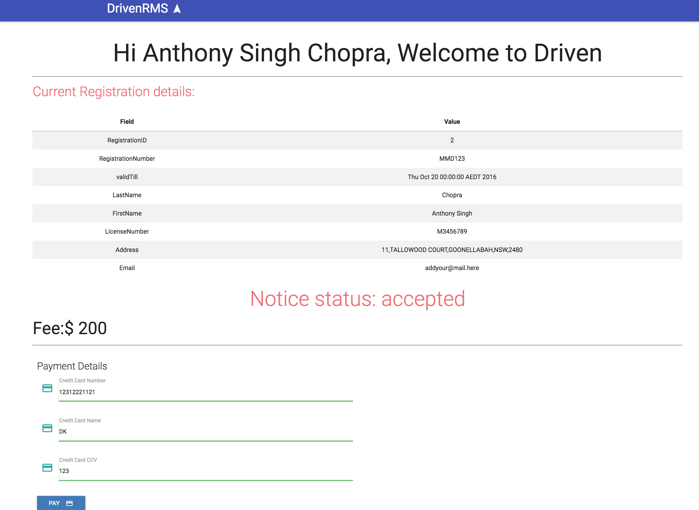
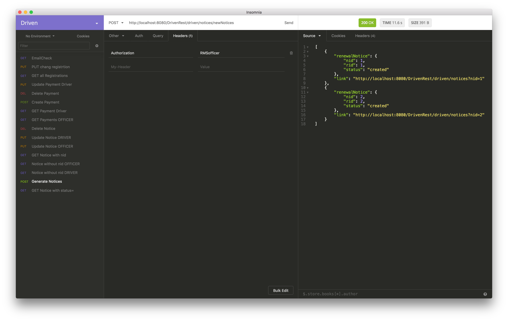

# Driven
COMP9322 - Assignment 2 RMS Car Registration Service

## BPEL services setup
1. Import `rmsService` into Eclipse as a Maven project
2. Run `Maven Install`
3. Deploy to Tomcat 7
4. Import `AutoCheckService` as a an Existing (generic) project
5. Deploy to ODE server using "Add/Remove"
6. Go to [http://localhost:6060/ode/deployment/bundles/](http://localhost:6060/ode/deployment/bundles/)

## Links
* [Specification](https://webcms3.cse.unsw.edu.au/COMP9322/16s2/resources/4329)

## REST Endpoints `/driven/`

### Notices

* `/notices/` __GET__
  * param eg. `?nid=2`
    * An OFFICER can pass no query param to retrieve all notices
  * Returns the details of a renewal notice uses query
  * OFFICER and DRIVER allowed

* `/notices/newNotices/` __POST__
  * Officer POSTs his key, notices are generated.
    A link to each notice is returned to the Officer.
  * Requires OFFICER

* `/notices/` __PUT__
  * Form param eg. `nid=2`
  * Update the status field of a renewal notice
  * OFFICER and DRIVER allowed
    * Not allowed from DRIVER once the status of a renewal notice has moved to 'Under-Review'

* `/notices/` __DELETE__
  * Form param eg. `nid=2`
  * If the status is rejected, Delete can be initiated by the driver, confirmed by officer

### Payment

* `/payments/` __GET__
  * return the latest representation of the payment resource
  * param eg. `?pid=2`
    * An OFFICER can pass no query param to retrieve all notices

* `/payments/` __POST__
  * param eg. `?pid=2`
  * Initiated by the officer when status == "Accepted"
  * Link to created payment is returned
  * Requires OFFICER

* `/payments/` __PUT__
  * param eg. `?pid=2`
  * Update a payment (initiated by the driver)
  * Driver may update the actual payment details
  * Requires DRIVER?

* `/payments/` __DELETE__
  * param eg. `?pid=2`
  * Delete a payment
  * Requires OFFICER auth

### Registrations

* `/registrations/` __GET__
  * param eg. `?rid=2`
  * retrieve registration details

* `/registrations/` __PUT__
  * param eg. `?rid=2`
  * Email, Address and RegistrationValidTill can be updated (by REST services only)
